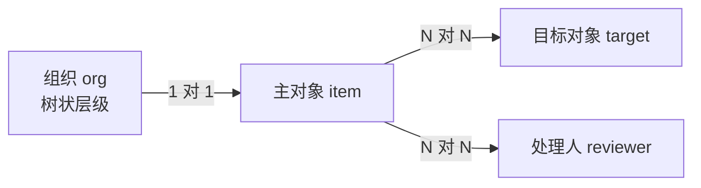

# PRD 写作范式 — 团队实际用法

从本团队三份实际 PRD 中抽出的骨架与写法。**这是范式参考，不是填空模板**：章节按需增减，但下面标注「稳定」的部分不要改造成通用咨询报告那套七章节结构。

> 本文只保留结构与写法，所有业务细节已脱敏，示例中的人名、部门、岗位、字段值均为占位。

## 目录

- [骨架：稳定的六段](#骨架稳定的六段)
- [目标：上线预期 + 分角色的衡量方式](#目标上线预期--分角色的衡量方式)
- [交互设计：最有价值的一节](#交互设计最有价值的一节)
- [实体与状态模型的写法](#实体与状态模型的写法)
- [分期表达](#分期表达)
- [两类 PRD 的骨架差异](#两类-prd-的骨架差异)
- [反模式](#反模式)

---

## 骨架：稳定的六段

三份 PRD 的一级标题高度一致，顺序也一致 —— **这个顺序本身是方法**：先讲清为什么做，再画流程，再定实体，然后才是规则和界面。

```
1. 背景 / 问题背景 / 背景与问题     ← 为什么现在要做，痛点是什么
2. 目标                            ← 上线预期 + 怎么衡量 + 产品/算法各自关注点
3. 关键流程图 / 核心用户旅程        ← Mermaid 或流程图，先看全貌
4. 实体与状态模型                   ← 实体关系 + 关系说明 + 状态相关性
5. 功能规则设计 / 过滤规则          ← 按子问题分节，每节一条规则
6. 交互设计                        ← 表格 + 截图，分期
7. 待讨论 / 待确认项                ← 结尾收口，不藏在正文里
```

要点：

- **背景在最前，且只讲问题不讲方案。** 读者要先知道什么是坏的，再看怎么修。
- **目标不是一句愿景，要能被验收。** 写法见下节。
- **流程图在实体之前。** 先有流程才能抽实体，反过来会得到一个跑不通的数据模型。
- **规则章节按"子问题"切分**，例如：谁可以用 / 画像适配 / 权限与可见范围 / 推荐逻辑 / 效果观测。每个二级标题回答一个能独立成立的问题，用 `1. 2. 3.` 编号。
- **待讨论放最后，单独成章。** 不要把待定项散落在正文里等人去找。

---

## 目标：上线预期 + 分角色的衡量方式

「目标」最容易写成一句谁都同意但没法验收的话（"提升推荐效果""优化用户体验"）。这一节要回答四件事：

1. **上线预期是什么** —— 上线后具体发生什么变化，用户侧能观察到什么。
2. **怎么衡量** —— 指标、口径、基线、目标值、观察周期。
3. **产品更该关注哪些点，各自怎么衡量。**
4. **算法更该关注哪些点，各自怎么衡量。**

第 3、4 条要分开写。**产品和算法看的不是同一组指标**，混在一起会出现两种失败：算法调完自认为达标，产品觉得体验没变好；或产品数据涨了，但涨的原因算法侧无法归因、下一版无从优化。

### 上线预期怎么写

写成**可观察的状态变化**，不是形容词：

```
上线预期：
- 用户不再需要手动逐个核对，系统在条件命中时主动给出候选结果
- 首次使用即可得到可用结果，无需先完成配置
- 原本需要 N 步的操作收敛到 1 步
```

**避免**："显著提升效率""体验更顺畅""更加智能"——这些无法验收，也无法证伪。

### 分角色的指标表

推荐用一张表把两侧摊开，**每行必须有口径和衡量方式，不能只有指标名**：

| 关注方 | 关注点 | 指标 | 口径 / 衡量方式 | 基线 → 目标 |
|---|---|---|---|---|
| 产品 | 功能是否被用到 | 入口点击率、功能渗透率 | 触发过该功能的用户 / 有机会触发的用户，按周去重 | x% → y% |
| 产品 | 是否解决了原痛点 | 完成率、平均步数、放弃率 | 从入口到达成目标的漏斗，分阶段看流失 | — |
| 产品 | 用户是否认可结果 | 采纳率、二次使用率 | 采纳 = 用户对结果做了正向动作；分子分母都要写清 | — |
| 算法 | 结果准不准 | 准确率 / 精确率 / 召回率 | 用哪批评测集、多少样本、谁标注、标注标准 | — |
| 算法 | 排序是否有效 | Top-N 命中率、排序相关性 | N 取值、命中定义（用户正向动作还是人工标注） | — |
| 算法 | 稳定性与成本 | 输出稳定性、超时率、单次成本 | 同一输入重复 N 次的一致性；P50 / P99 延迟 | — |

### 两侧的分工原则

| | 产品关注 | 算法关注 |
|---|---|---|
| **问什么** | 用户用不用、用了有没有解决问题 | 给出的结果对不对、稳不稳定 |
| **指标性质** | 行为与转化：渗透率、完成率、采纳率、留存 | 质量与效率：准确率、召回率、Top-N、延迟、成本 |
| **数据来源** | 埋点与行为日志 | 评测集、人工标注、线上抽样回流 |
| **失败长什么样** | 功能可用但没人用，或用了绕回老路 | 指标达标但用户不采纳 |

### 三条容易写漏的

- **采纳率这类指标必须写清分子分母。** "采纳率"可以指"采纳数 / 曝光数"也可以指"采纳数 / 用户数"，差一个量级。口径不写，上线后必然对不上。
- **要有基线。** 没有 before 就无法说明 after 是改进。拿不到基线就明确写"首版仅埋点，不设目标值"，而不是编一个数。
- **算法指标要说明评测集来源。** 用哪批数据、多少条、谁标的、标注标准是什么。不写清，算法侧的"准确率 85%"无法被复核，也无法跨版本比较。

### 与「效果观测」章节的关系

「目标」定的是**上线要达到什么**，功能规则里的「效果观测」定的是**线上怎么持续看**。前者是验收标准，后者是埋点与看板方案。两者指标应当一致——如果目标里的指标在效果观测里没有对应埋点，说明这个目标上线后根本量不出来。

---

## 交互设计：最有价值的一节

这一节的写法最值得复用，也是最容易写砸的一节。

### 四列表格，列名按场景选一组

| 场景 | 列结构 |
|---|---|
| 通用（默认用这组） | **阶段 / 入口 / 描述 / 交互** |
| 强调形态差异（同一功能多种展示形态） | **形态 / 入口 / 描述 / 交互** |
| 涉及配置项或 JSON | **用户使用阶段 / 功能描述 / 交互 / 输入&输出** |

- **交互列放截图**，图上用红框标出要看的位置。
- **同一阶段有多个入口时，阶段列跨行合并**（`rowspan`）。
- 需要额外列才加，不要默认加满。

### 描述列的三段式 —— 这是范式核心

描述列**不是**一段散文，而是固定用加粗小标题分层。三段缺一不可：

```
用户诉求：想快速了解这个工具怎么用
用户动作：进入首页，点击「了解使用方式」
阶段判定逻辑：当用户还没有创建任何项目时
```

为什么是这三段：

| 段 | 回答什么 | 少了会怎样 |
|---|---|---|
| **用户诉求** | 用户此刻想干什么（用户视角，非功能视角） | 变成功能说明书，评审时没人能判断该不该做 |
| **用户动作** | 具体点哪、走哪条路径 | 开发不知道要实现哪个入口 |
| **阶段判定逻辑** | 什么条件下出现这个形态 | **最常漏的一段** —— 前端不知道何时渲染，会做成常显 |

按需追加的段（有就写，没有不占位）：

- `形态规则：` 什么时候出现这个形态
- `展示字段：` 逐字段列出，含默认值与可选值
- `逻辑：` 字段取值口径（如「组织取对象所属的末级组织」）
- `顺序：` 为什么这样排 —— **写理由，不只写结论**（如「放在下面，因为不是此处最重要信息」）
- `触发时机：` 自然语言触发类功能必写
- `可支持修改选项：` 用户能改什么
- `角色：` 多角色时按角色分段（如 `TA & 用人经理：`）

### 字段级的默认值与可选值都要写出来

不要写"支持选择时间范围"，要写成：

```
时间范围：默认填充最近一年，支持选择「最近三个月」「时间不限」
过滤范围：默认填充当前对象所属组织 && 关联负责人，支持搜索用户姓名 && 组织名称填充
过滤条件：条件A未通过、条件A已通过、条件B未通过
```

默认值、可选项、能否搜索、多选还是单选 —— 这些不写清，开发一定会来问，或者直接猜错。

### 自然语言触发的功能，额外写两件事

AI 产品特有：当功能由用户随口一句话触发时，描述列必须包含

1. **完整的用户路径叙事** —— 用户在什么情境下、因为什么说了这句话。写成故事，不是写成条件。
2. **触发时机的判定边界** —— 「用户明确用自然语言说明想改 X / 命中任意表单内字段」。边界不写，模型会过度触发或完全不触发。

---

## 实体与状态模型的写法

三段结构：

**1. 实体关系 —— 用 Mermaid，不用文字描述**



节点写「中文名 + 英文标识」，边上标基数（`1 对 1` / `N 对 N`），特殊结构在节点里注明（如「树状层级」）。

**2. 关系说明 —— 逐条解释图上看不出的部分**

```
- **主对象 ↔ 目标对象 / 处理人**：均为多对多；一个主对象可关联多个目标对象，反之亦然。
- **主对象 → 组织**：一个主对象归属唯一一个组织；组织本身是树状层级（存在上下级）。
```

图给全貌，文字补图表达不了的约束。**两者都要有**，不要只画图。

**3. 状态相关性 —— 讲清这个功能依赖哪些状态**

用一句话点明功能的本质，再指向下游章节。这种「先定义本质、再交给下节展开」的写法，比一上来堆规则更容易让评审对齐：

> 过滤的本质，是判断某目标对象相对「当前使用方 + 当前范围 + 时间窗」是否已处于「已处理 / 已查看 / 已完成」状态。状态的可见性与判定范围由下节的过滤维度决定。

---

## 分期表达

**一期 / 二期 各自一个二级标题，各自一张表。**

- 本期不做的，标题里直接写明：`## 二期（这期不做）`。不要删掉 —— 保留能说明"想过但砍了"，避免评审时反复问。
- 分期多于两期时，一期一个一级标题（`一期 - 预制快捷入口` / `二期 - 开放自定义入口` / `长期 - 用户自定义 skill`），并在标题里带上该期的核心特征，而不只是编号。

---

## 两类 PRD 的骨架差异

| | 功能型 PRD | 方案探索型 PRD |
|---|---|---|
| 典型主题 | 一个明确功能（过滤、推荐） | 一个方向的分期演进（入口封装） |
| 骨架 | 背景 → 流程图 → 实体模型 → 规则 → 交互 → 待讨论 | 背景与问题 → 目标 → 当前用户路径 → 一期 / 二期 / 三期 / 长期 → 待讨论 |
| 实体模型 | **必写** | 通常不写 |
| 交互表 | 按阶段或形态 | 嵌在每一期里 |
| 特有章节 | 功能规则设计 | 当前用户路径、「为什么可行」论证 |

**方案探索型多一节「为什么可行」** —— 提出机制后，用子标题逐条论证（字段可选 / 生成内容优化 / 场景），并配 before / after 截图对比。方案越新，这节越不能省。

---

## 反模式

- ❌ **用通用咨询报告的七章节大结构**（现状分析 / 竞品对标 / 战略建议…）。团队 PRD 走上面的骨架。
- ❌ **用大词、隐喻、黑话**（赋能、抓手、闭环、打通链路、飞轮、未展开的缩写）。一句话如果开发/设计/算法不能照着做，就重写 → [../../../shared/verification.md](../../../shared/verification.md)
- ❌ **目标写成不可验收的形容词**（"显著提升效率""体验更顺畅"）。要有指标、口径、基线。
- ❌ **产品与算法指标混在一起**。两侧关注点不同，分开列，各自写清衡量方式。
- ❌ **只给指标名不给口径**。"采纳率"不写分子分母，上线后一定对不上。
- ❌ **目标里的指标在「效果观测」里没有对应埋点** —— 等于这个目标量不出来。
- ❌ **描述列写成散文**。必须用加粗小标题分层。
- ❌ **漏掉阶段判定逻辑**。这是三段式里最常漏、后果最直接的一段。
- ❌ **只写"支持配置 X"而不给默认值和可选项**。
- ❌ **只画实体关系图不写关系说明**，或反之。
- ❌ **待定项散落在正文**，不单独成章。
- ❌ **删掉不做的分期**。标注「这期不做」保留下来。
- ❌ **交互列放整页截图**。要裁剪到红框区域，否则表格里看不清。
